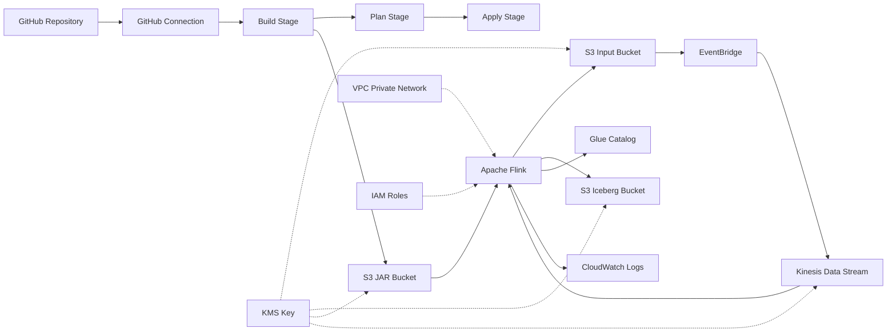

# Data Pike — Infrastructure Walkthrough

This document explains what our Terraform infrastructure does in plain English. No Terraform or AWS expertise required.

## The Big Picture

Data Pike is a streaming data pipeline. Files get uploaded to cloud storage, the system detects them automatically, processes the data inside, and writes the results to a data warehouse. Everything runs on AWS.

Here's the flow:



## What Each Module Does

### 1. Storage Module (`modules/storage/`)

Think of this as the "filing cabinet" for the whole system. It creates:

- **Input Bucket** — where you drop files (JSON, XML, CSV) to be processed. When a file lands here, the pipeline kicks off automatically.
- **Iceberg Bucket** — where processed results are stored. This is the data warehouse output.
- **JAR Bucket** — where the compiled application code lives. The CI/CD pipeline uploads new versions here.
- **KMS Encryption Key** — a single master key that encrypts everything at rest. Every bucket, every stream, every log. Nothing is stored unencrypted.
- **Glue Catalog** — a database catalog that keeps track of the structure (schema) of the output data. Think of it like a table of contents for the data warehouse.

**Security highlights:**
- All three buckets block public access entirely — no one on the internet can reach them.
- All three buckets require HTTPS — unencrypted HTTP requests are denied.
- All three buckets have versioning enabled — accidental overwrites or deletes can be recovered.
- Everything is encrypted with the same KMS key, which rotates automatically every year.

### 2. Networking Module (`modules/networking/`)

This creates an isolated private network so the Flink application never touches the public internet.

- **VPC (Virtual Private Cloud)** — a private network in AWS, like having your own data center.
- **Private Subnets** — two network segments in different availability zones (physical data centers). If one goes down, the other keeps running.
- **Security Groups** — firewall rules that control what traffic is allowed. The Flink app can only talk to specific AWS services over HTTPS, and nothing else.
- **VPC Endpoints** — private tunnels from our network directly to AWS services (S3, Kinesis, Glue, KMS, CloudWatch, STS). Traffic never leaves the AWS backbone network.

**Why this matters:**
Without VPC endpoints, the Flink app would need a NAT Gateway (a public internet exit point) to reach AWS services. VPC endpoints keep all traffic private and also save money — NAT Gateways charge per GB of data transferred.

**Security highlights:**
- No internet gateway, no NAT gateway — the Flink app has zero internet access.
- Security groups follow least-privilege: only HTTPS (port 443) to specific endpoints, plus DNS.
- Optional VPC flow logs can be enabled to record all network traffic for auditing.

### 3. Kinesis Module (`modules/kinesis/`)

This is the "notification highway" that tells Flink when new files arrive.

- **Kinesis Data Stream** — a real-time message queue. EventBridge puts file notifications in, Flink reads them out.
- **EventBridge Rule** — watches the Input Bucket for new files. When a file is created, it captures the event.
- **EventBridge Target** — routes the captured event into the Kinesis stream, using the file path as the partition key (so files are distributed evenly across shards).

**How it works in practice:**
1. You upload `weather_data.json` to the Input Bucket
2. S3 emits an "Object Created" event
3. EventBridge catches it and sends a notification to Kinesis
4. Flink picks up the notification, reads the file from S3, and processes it

**Security highlights:**
- The Kinesis stream is encrypted with the KMS key.
- EventBridge has its own IAM role that can only put records into this specific stream — nothing else.

### 4. Flink Module (`modules/flink/`)

This is the brain of the pipeline — the application that actually processes the data.

- **Managed Flink Application** — runs Apache Flink 2.2 as a managed service. AWS handles the servers, scaling, and patching. We just provide the application code (a JAR file).
- **Execution IAM Role** — the identity the Flink app runs as. It defines exactly what the app is allowed to do.

**What the Flink app is allowed to do (and nothing more):**
- Read from the Kinesis stream (consume notifications)
- Read files from the Input Bucket
- Write results to the Iceberg Bucket
- Read/write table metadata in the Glue Catalog
- Write logs to CloudWatch
- Decrypt data using the KMS key
- Create/delete network interfaces in the VPC (required for VPC deployment)

**What it cannot do:**
- Access any other S3 bucket
- Write to the Input Bucket or JAR Bucket
- Access any other Kinesis stream
- Reach the internet
- Modify IAM roles or policies
- Access any service not listed above

**Configuration:**
- Auto-scaling is enabled — AWS adds capacity when the workload increases
- Checkpointing is on by default — if the app crashes, it resumes from where it left off
- The app runs in STREAMING mode — it processes data continuously, not in batches
- `prevent_destroy` is set — Terraform won't accidentally delete this resource

### 5. Monitoring Module (`modules/monitoring/`)

Creates CloudWatch log groups where everything writes its logs:

- **Flink log group** — application logs from the streaming pipeline
- **CodeBuild Build log group** — logs from the Maven build stage
- **CodeBuild Plan log group** — logs from the Terraform plan stage
- **CodeBuild Apply log group** — logs from the Terraform apply stage

All log groups have configurable retention (default: 1 day in dev) and can optionally be encrypted with KMS.

### 6. CI/CD Module (`modules/cicd/`)

This automates the build and deployment process. When you push code to GitHub, it automatically builds, plans, and (after approval) deploys.

- **GitHub Connection** — links AWS to the GitHub repository. Requires a one-time manual authorization in the AWS console.
- **Pipeline Artifacts Bucket** — temporary storage for files passed between pipeline stages.
- **CodeBuild Build Project** — compiles the Java code with Maven, produces a FAT JAR, uploads it to the JAR Bucket.
- **CodeBuild Plan Project** — runs `terraform plan` to preview what infrastructure changes would happen.
- **CodeBuild Apply Project** — runs `terraform apply` to make the infrastructure changes.
- **CodePipeline** — orchestrates the five stages in order:

```
Source → Build → Plan → Approval → Apply
  │        │       │        │         │
  │        │       │        │         └─ Applies the Terraform plan
  │        │       │        └─ Human reviews and approves/rejects
  │        │       └─ Generates a Terraform plan
  │        └─ Compiles Java, uploads JAR
  └─ Pulls code from GitHub
```

**The Approval stage is critical** — no infrastructure changes happen without a human reviewing the plan first.

**Security highlights:**
- Each CodeBuild stage has its own IAM role with only the permissions it needs.
- The Build role can write to the JAR bucket but cannot modify infrastructure.
- The Plan role can read infrastructure state but cannot make changes.
- The Apply role can make changes but only through a pre-generated plan file.
- All pipeline artifacts are encrypted with the KMS key.

## How Permissions Work (IAM)

Every component has its own IAM role — no shared credentials, no hardcoded keys. Each role follows the principle of least privilege: it can only do exactly what it needs, nothing more.

| Component | Can Read | Can Write | Cannot Access |
|---|---|---|---|
| EventBridge | S3 events | Kinesis stream | Anything else |
| Flink | Kinesis, Input Bucket, Glue | Iceberg Bucket, Glue, CloudWatch | JAR Bucket (write), other streams |
| CodeBuild Build | Source code | JAR Bucket, CloudWatch | Infrastructure, other buckets |
| CodeBuild Plan | Terraform state, all infra (read) | CloudWatch | Modify any infrastructure |
| CodeBuild Apply | Terraform plan file | All infrastructure | Anything outside the plan |
| CodePipeline | Pipeline artifacts | Pipeline artifacts | Direct access to any infra |

## Encryption Summary

| Resource | Encryption | Key |
|---|---|---|
| S3 Buckets (all 3 + artifacts) | AES-256 via KMS | Shared CMK with auto-rotation |
| Kinesis Data Stream | AES-256 via KMS | Same shared CMK |
| CloudWatch Logs | Optional KMS | Same shared CMK (when enabled) |
| Data in transit | TLS 1.2+ enforced | S3 bucket policies deny HTTP |
| VPC traffic to AWS services | TLS via VPC endpoints | Private network path |

## What `terraform destroy` Removes

Running `terraform destroy` will delete everything except:
- The **Terraform state S3 bucket** (`prevent_destroy = true`)
- The **Flink application** (`prevent_destroy = true`) — you must remove this protection manually first

Everything else — buckets, streams, VPC, IAM roles, CodePipeline, log groups — will be destroyed.
