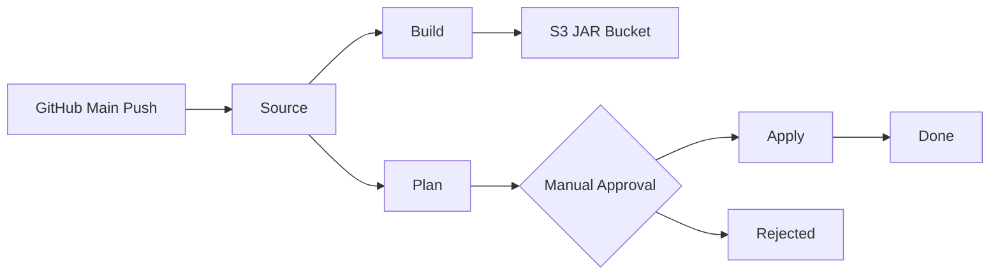

# Data Pike — CI/CD Pipeline Guide

This document explains the CI/CD pipeline: what it does, how it works, and what permissions each component has. Written for engineers who may not be familiar with AWS CodePipeline, CodeBuild, or IAM.

For the data pipeline infrastructure, see [docs/infrastructure-guide.md](infrastructure-guide.md).

---

## What the Pipeline Does

When you push code to the `main` branch on GitHub, the pipeline automatically:

1. Pulls the latest code
2. Compiles it into a deployable JAR file
3. Generates a Terraform plan showing what infrastructure changes would happen
4. Pauses for a human to review and approve
5. Applies the approved changes

No infrastructure changes happen without human approval.

---

## Pipeline Flow Diagram



---

## Resources Created

The CI/CD module (`modules/cicd/`) creates these AWS resources:

| Resource | What It Is | Why It Exists |
|---|---|---|
| CodePipeline | Pipeline orchestrator | Coordinates the five stages in sequence. Manages artifact passing between stages. |
| CodeBuild Build Project | Build environment | Compiles Java code with Maven, produces a FAT JAR, uploads it to the JAR Bucket. |
| CodeBuild Plan Project | Build environment | Runs `terraform plan` to preview infrastructure changes. Outputs a plan binary. |
| CodeBuild Apply Project | Build environment | Runs `terraform apply` using the pre-generated plan from the Plan stage. |
| CodeConnections Connection | GitHub integration | Links AWS to your GitHub repository. Requires one-time manual authorization in the AWS console. |
| Pipeline Artifacts Bucket (S3) | Temporary storage | Stores artifacts (source code, plan files) passed between pipeline stages. |
| 4 IAM Roles | Identities for each component | Each component gets its own role with only the permissions it needs. |

### Pipeline Artifacts Bucket Security

Same controls as all other buckets in the project:
- KMS encryption at rest (shared CMK)
- Versioning enabled
- All public access blocked
- TLS-only bucket policy (HTTP requests denied)

---

## Stage-by-Stage Breakdown

### Stage 1: Source

| Setting | Value |
|---|---|
| Provider | CodeStarSourceConnection (CodeConnections v2) |
| Trigger | Push to the configured branch (default: `main`) |
| Output | `source_output` artifact containing the full repository |

The GitHub connection starts in `PENDING` status after creation. A human must complete the authorization handshake in the AWS console (Developer Tools → Connections) before the pipeline can pull code.

### Stage 2: Build

| Setting | Value |
|---|---|
| Compute | `BUILD_GENERAL1_MEDIUM` (7 GB RAM, 4 vCPUs) |
| Image | `aws/codebuild/amazonlinux2-x86_64-standard:5.0` |
| Runtime | Amazon Corretto 17 (Java 17) |
| Timeout | 30 minutes |
| Input | `source_output` from Stage 1 |

What it does:
1. Installs Java 17 and Maven
2. Runs `mvn clean package -DskipTests` (compiles and creates a FAT JAR with the Shade plugin)
3. Uploads the JAR to `s3://{jar-bucket}/{file_key}` (the "latest" path)
4. Also uploads a commit-tagged copy: `s3://{jar-bucket}/jars/my-app-{commit-hash}.jar`

### Stage 3: Plan

| Setting | Value |
|---|---|
| Compute | `BUILD_GENERAL1_SMALL` (3 GB RAM, 2 vCPUs) |
| Image | `aws/codebuild/amazonlinux2-x86_64-standard:5.0` |
| Timeout | 30 minutes |
| Input | `source_output` from Stage 1 |
| Output | `plan_output` containing the Terraform plan binary |

What it does:
1. Downloads and verifies Terraform (SHA-256 checksum validation)
2. Runs `terraform init` with the S3 backend configuration
3. Runs `terraform plan -out=tfplan` to generate a plan binary
4. Runs `terraform show tfplan` to log a human-readable version
5. Passes the plan binary to the next stage

### Stage 4: Manual Approval

The pipeline pauses here. A human must:
1. Review the Terraform plan output in the Plan stage's CloudWatch logs
2. Approve (pipeline continues to Apply) or Reject (pipeline stops)

This is the safety gate. No infrastructure changes happen without explicit human approval.

### Stage 5: Apply

| Setting | Value |
|---|---|
| Compute | `BUILD_GENERAL1_SMALL` (3 GB RAM, 2 vCPUs) |
| Image | `aws/codebuild/amazonlinux2-x86_64-standard:5.0` |
| Timeout | 30 minutes |
| Input | `plan_output` from Stage 3 |

What it does:
1. Downloads and verifies Terraform (same SHA-256 check)
2. Runs `terraform init` with the S3 backend
3. Runs `terraform apply -auto-approve tfplan` using the pre-generated plan

The Apply stage can only execute the exact plan that was reviewed and approved. It cannot make ad-hoc changes.

---

## IAM Roles and Permissions

Each component has its own IAM role. This section documents every role, what assumes it, and exactly what it's allowed to do.

### Role 1: CodePipeline Orchestrator

| Property | Value |
|---|---|
| Role name | `{project}-{env}-codepipeline` |
| Assumed by | `codepipeline.amazonaws.com` |
| Condition | `aws:SourceAccount` must match the current account |

This role orchestrates the pipeline but doesn't directly access infrastructure.

| Policy | Actions | Resource | Why |
|---|---|---|---|
| S3 Artifacts | `GetObject`, `GetObjectVersion`, `GetBucketVersioning`, `PutObject`, `PutObjectAcl`, `ListBucket` | Pipeline artifacts bucket only | Pass artifacts (source code, plan files) between stages |
| CodeConnections | `UseConnection` | The specific GitHub connection | Pull source code from GitHub |
| CodeBuild | `BatchGetBuilds`, `StartBuild` | The three CodeBuild projects only | Trigger and monitor build/plan/apply stages |
| KMS | `Decrypt`, `DescribeKey`, `GenerateDataKey` | The shared CMK | Encrypt/decrypt pipeline artifacts in S3 |

What it cannot do:
- Access any S3 bucket other than the artifacts bucket
- Modify any infrastructure directly
- Access Kinesis, Flink, or any data pipeline resource

---

### Role 2: Build Stage (CodeBuild)

| Property | Value |
|---|---|
| Role name | `{project}-{env}-codebuild-build` |
| Assumed by | `codebuild.amazonaws.com` |
| Condition | `aws:SourceAccount` must match the current account |

This role compiles code and uploads the JAR. It has no infrastructure access.

| Policy | Actions | Resource | Why |
|---|---|---|---|
| S3 JAR Write | `PutObject`, `GetObject`, `GetBucketLocation`, `ListBucket` | JAR bucket only | Upload the compiled FAT JAR |
| CloudWatch | `CreateLogStream`, `PutLogEvents`, `DescribeLogGroups`, `DescribeLogStreams` | Build log group only | Write build logs |
| KMS | `Decrypt`, `DescribeKey`, `GenerateDataKey` | The shared CMK | Encrypt the JAR when uploading to the KMS-encrypted bucket |
| CodeBuild Reports | `CreateReportGroup`, `CreateReport`, `UpdateReport`, `BatchPutTestCases`, `BatchPutCodeCoverages` | Build report groups only | Publish test results and code coverage |

What it cannot do:
- Read or write to the Input, Iceberg, or State buckets
- Access Kinesis, Flink, or any data pipeline resource
- Modify any infrastructure
- Access Terraform state

---

### Role 3: Plan Stage (CodeBuild)

| Property | Value |
|---|---|
| Role name | `{project}-{env}-codebuild-plan` |
| Assumed by | `codebuild.amazonaws.com` |
| Condition | `aws:SourceAccount` must match the current account |

This role runs `terraform plan`. It can read infrastructure state but cannot modify anything.

| Policy | Actions | Resource | Why |
|---|---|---|---|
| S3 State Read | `GetObject`, `GetObjectVersion`, `ListBucket`, `GetBucketLocation` | Terraform state bucket only | Read the current Terraform state to compute a plan |
| DynamoDB Lock | `GetItem`, `PutItem`, `DeleteItem`, `DescribeTable` | Terraform lock table | Acquire/release the state lock during planning |
| CloudWatch | `CreateLogStream`, `PutLogEvents`, `DescribeLogGroups`, `DescribeLogStreams` | Plan log group only | Write plan logs |
| KMS | `Decrypt`, `DescribeKey`, `GenerateDataKey` | The shared CMK | Decrypt the encrypted Terraform state |
| Read-Only Resources | Various `Describe*`, `Get*`, `List*` actions | Scoped to project resources | Read current state of S3 buckets, Kinesis, EC2/VPC, IAM roles, KMS, CloudWatch, EventBridge, Flink, DynamoDB, Secrets Manager | 
| CodeBuild Reports | Report actions | Plan report groups | Publish reports |

The read-only resource policy deserves more detail. Here's what it can read and why:

| Service | Actions | Scoped To | Why Terraform Plan Needs It |
|---|---|---|---|
| S3 | Bucket metadata (versioning, policy, encryption, tags, etc.) | Input, Iceberg, JAR buckets | Compare current bucket config against desired state |
| Kinesis | `DescribeStream`, `DescribeStreamSummary`, `ListTagsForStream` | The specific stream | Compare current stream config |
| EC2 | `DescribeVpcs`, `DescribeSubnets`, `DescribeSecurityGroups`, etc. | Resources in the account/region | Compare current network config |
| IAM | `GetRole`, `GetRolePolicy`, `ListRolePolicies`, etc. | Roles/policies prefixed with `{project}-{env}-` | Compare current IAM config |
| KMS | `DescribeKey`, `GetKeyPolicy`, `GetKeyRotationStatus`, `ListAliases` | The shared CMK | Compare current key config |
| CloudWatch | `DescribeLogGroups`, `ListTagsForResource` | The four log groups | Compare current log group config |
| EventBridge | `DescribeRule`, `ListTargetsByRule`, `ListTagsForResource` | Rules prefixed with `{project}-{env}-` | Compare current EventBridge config |
| Flink | `DescribeApplication`, `ListTagsForResource` | The specific Flink application | Compare current Flink app config |
| DynamoDB | `DescribeTable`, `ListTagsOfResource` | The lock table | Compare current table config |
| Secrets Manager | `DescribeSecret`, `GetResourcePolicy` | Secrets prefixed with `{project}-{env}-` | Compare current secrets config |

What it cannot do:
- Write to or modify any infrastructure resource
- Write to the Terraform state bucket (read-only)
- Access data inside S3 objects (only bucket metadata)
- Start, stop, or update the Flink application
- Create, delete, or modify any resource

---

### Role 4: Apply Stage (CodeBuild)

| Property | Value |
|---|---|
| Role name | `{project}-{env}-codebuild-apply` |
| Assumed by | `codebuild.amazonaws.com` |
| Condition | `aws:SourceAccount` must match the current account |

This is the most powerful role. It can create, modify, and delete infrastructure. However, it only runs after human approval, and it only executes the pre-generated plan.

| Policy | Actions | Resource | Why |
|---|---|---|---|
| S3 State Read/Write | `GetObject`, `PutObject`, `DeleteObject`, `ListBucket`, etc. | Terraform state bucket | Read and update Terraform state after applying changes |
| DynamoDB Lock | `GetItem`, `PutItem`, `DeleteItem`, `DescribeTable` | Lock table | Acquire/release state lock during apply |
| CloudWatch | Full log management + `CreateLogGroup`, `DeleteLogGroup`, `PutRetentionPolicy`, `TagResource`, etc. | All four log groups | Manage log groups as infrastructure (create, configure retention, tag) |
| CodeBuild Reports | Report actions | Apply report groups | Publish reports |

The resource management policy covers all the infrastructure Terraform needs to create and manage:

| Service | What It Can Do | Scoped To |
|---|---|---|
| S3 | Create/delete buckets, manage versioning, encryption, policies, public access blocks, notifications, tags | Input, Iceberg, JAR buckets only |
| Kinesis | Create/delete streams, manage encryption, shards, tags | The specific stream only |
| EC2/VPC | Full VPC lifecycle: create/delete VPCs, subnets, security groups, route tables, VPC endpoints, manage rules and tags | Resources in the account/region |
| IAM | Full role lifecycle: create/delete roles, manage policies, pass roles, manage instance profiles | Roles/policies prefixed with `{project}-{env}-` |
| KMS | Create keys, manage policies, rotation, aliases, encrypt/decrypt | The shared CMK and its alias |
| EventBridge | Full rule lifecycle: create/delete rules, manage targets, tags | Rules prefixed with `{project}-{env}-` |
| Flink (Kinesis Analytics v2) | Full app lifecycle: create/delete/update/start/stop, manage VPC config, logging, tags | The specific Flink application |
| DynamoDB | Full table lifecycle: create/delete/update, manage tags, read/write items | The lock table only |
| Secrets Manager | Full secret lifecycle: create/delete/update, manage policies, rotation, tags | Secrets prefixed with `{project}-{env}-` |
| RDS | Full DB lifecycle: create/delete/modify instances, proxies, subnet groups, parameter groups, tags | Resources prefixed with `{project}-{env}` |

Important constraints:
- All IAM actions are scoped to resources prefixed with `{project}-{env}-` — it cannot modify roles outside this project
- All S3 actions are scoped to the three project buckets — it cannot access other buckets
- The Flink and Kinesis actions target only the specific resources for this project
- It can only run after the Approval stage is passed by a human

---

## Security Design Principles

### Separation of Duties

Each pipeline stage has its own IAM role with only the permissions it needs:

```
Build  → Can compile code and upload JARs. Cannot touch infrastructure.
Plan   → Can read infrastructure state. Cannot modify anything.
Apply  → Can modify infrastructure. Only runs after human approval.
```

No single role has both "read source code" and "modify infrastructure" permissions.

### Least Privilege

Every permission is scoped to specific resources:
- S3 actions target specific buckets, not `s3:*`
- IAM actions target roles with the project prefix, not all roles
- KMS actions target the specific CMK, not all keys
- CodeBuild actions target the specific projects, not all projects

### Human Gate

The Manual Approval stage ensures:
- Every infrastructure change is reviewed before execution
- The plan output shows exactly what will change
- Rejecting the approval stops the pipeline completely
- The Apply stage can only execute the exact plan that was approved

### Encryption

- Pipeline artifacts are encrypted with KMS in the artifacts bucket
- Terraform state is encrypted in the state bucket
- All CodeBuild logs go to CloudWatch (optionally KMS-encrypted)
- All S3 communication uses TLS (bucket policies deny HTTP)

### Audit Trail

Every action is logged:
- Build logs → what was compiled and uploaded
- Plan logs → what changes were proposed
- Apply logs → what changes were made
- CloudWatch retains logs for the configured retention period
