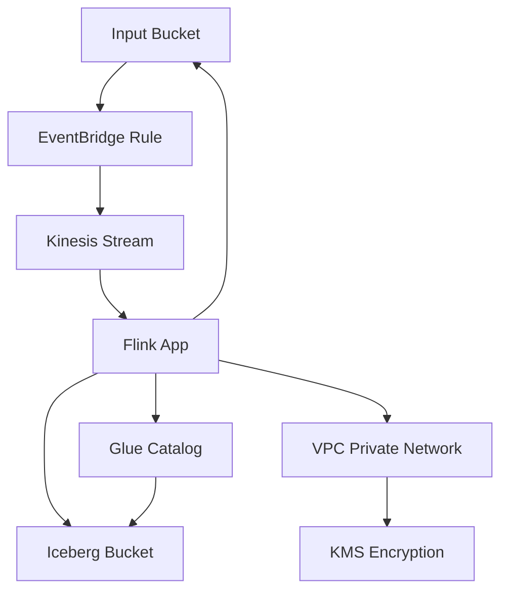

# Data Pike — Infrastructure Guide

This document explains every piece of infrastructure that Terraform creates, what each service does, and why it exists. Written for engineers who may not be familiar with Terraform or AWS security concepts.

---

## How to Read This Document

Each section covers one Terraform module. For every module you'll find:
- What it creates (the AWS resources)
- Why those resources exist (their purpose in the pipeline)
- What roles and permissions are involved (who can do what)

If you're looking for the CI/CD pipeline specifically, see [docs/cicd-guide.md](cicd-guide.md).

---

## Architecture Diagram



---

## 1. Storage Module (`modules/storage/`)

This module creates the data storage layer and the encryption key that protects everything.

### Resources Created

| Resource | What It Is | Why It Exists |
|---|---|---|
| KMS Key | A customer-managed encryption key | Encrypts all data at rest across every bucket and the Kinesis stream. Rotates automatically every year. |
| KMS Alias | A friendly name for the key | So other modules can reference the key by name instead of a long ID. |
| Input Bucket (S3) | Cloud file storage | Where you upload files (JSON, XML, CSV) to be processed. Uploading a file triggers the pipeline. |
| Iceberg Bucket (S3) | Cloud file storage | Where the Flink app writes processed results. This is the data warehouse output. |
| JAR Bucket (S3) | Cloud file storage | Where the compiled application code (JAR file) is stored. Flink loads its code from here. |
| Glue Database | A metadata catalog database | Registers the schema of the output data so query engines (like Athena) know how to read it. |
| Glue Table | A table definition in the catalog | Defines the columns (date, max_temp, max_temp_city, min_temp, min_temp_city) of the Iceberg output table. |

### Security Controls on Every Bucket

Each of the three S3 buckets has identical security controls:

| Control | What It Does | Why |
|---|---|---|
| KMS encryption | All objects encrypted at rest with the shared CMK | Protects data if storage media is compromised |
| Bucket key enabled | Reduces KMS API calls per object | Cost optimization without reducing security |
| Versioning enabled | Keeps previous versions of every object | Protects against accidental overwrites or deletes |
| Block all public access | Four separate settings that prevent any public exposure | Defense in depth — even if a policy mistake is made, public access is still blocked |
| TLS-only bucket policy | Denies any request made over plain HTTP | Ensures data is encrypted in transit |

### KMS Key Policy

The KMS key has two policy statements:

| Who | What They Can Do | Why |
|---|---|---|
| AWS account root | Full KMS access (`kms:*`) | Allows the account administrator to manage the key. This is standard practice — without it, the key could become unmanageable. |
| CloudWatch Logs service | Encrypt, Decrypt, GenerateDataKey, DescribeKey | Allows CloudWatch to encrypt log data with this key (when KMS log encryption is enabled). Scoped to log groups in this account only. |

---

## 2. Networking Module (`modules/networking/`)

This module creates an isolated private network. The Flink application runs inside this network and has no internet access.

### Resources Created

| Resource | What It Is | Why It Exists |
|---|---|---|
| VPC | A virtual private cloud (isolated network) | Gives the Flink app its own network, separate from everything else. DNS support and hostnames are enabled so services can find each other. |
| Private Subnets (x2) | Network segments in different availability zones | Two subnets in two physical data centers. If one AZ has an outage, the other keeps running. |
| Route Table | Network routing rules | Directs traffic from the subnets to VPC endpoints. No route to the internet. |
| Flink Security Group | Firewall rules for the Flink app | Controls exactly what network traffic Flink can send and receive. |
| Endpoints Security Group | Firewall rules for VPC endpoints | Controls what can talk to the private AWS service endpoints. |
| VPC Endpoints (6 total) | Private connections to AWS services | Allows Flink to reach AWS services without going through the internet. |

### VPC Endpoints Explained

A VPC endpoint is a private tunnel from your network directly to an AWS service. Without endpoints, the Flink app would need a NAT Gateway (an internet exit point) to reach services like S3 or Kinesis. Endpoints keep traffic private and save money.

| Endpoint | Type | Service | Why Flink Needs It |
|---|---|---|---|
| S3 | Gateway | `com.amazonaws.{region}.s3` | Read input files, write results, load JAR. Gateway type is free. |
| Kinesis | Interface | `com.amazonaws.{region}.kinesis-streams` | Consume file notifications from the data stream. |
| Glue | Interface | `com.amazonaws.{region}.glue` | Read/write Iceberg table metadata in the catalog. |
| KMS | Interface | `com.amazonaws.{region}.kms` | Decrypt encrypted data from S3 and Kinesis. |
| CloudWatch Logs | Interface | `com.amazonaws.{region}.logs` | Write application logs. |
| STS | Interface | `com.amazonaws.{region}.sts` | Assume IAM roles (required for AWS SDK authentication). |

### Security Group Rules

The Flink security group follows a "deny all, allow specific" model. Here's exactly what's allowed:

| Direction | Protocol | Port | Destination | Why |
|---|---|---|---|---|
| Outbound | UDP | 53 | VPC DNS resolver | DNS lookups to resolve AWS service hostnames |
| Outbound | TCP | 53 | VPC DNS resolver | DNS lookups (TCP fallback for large responses) |
| Outbound | TCP | 443 | S3 prefix list | HTTPS to S3 via the gateway endpoint |
| Outbound | TCP | 443 | Endpoints security group | HTTPS to all interface endpoints (Kinesis, Glue, KMS, Logs, STS) |

The endpoints security group allows:

| Direction | Protocol | Port | Source | Why |
|---|---|---|---|---|
| Inbound | TCP | 443 | Flink security group | Accept HTTPS connections from the Flink app |

There are no other rules. Flink cannot reach the internet, other VPCs, or any service not listed above.

### Optional: VPC Flow Logs

When `enable_vpc_flow_logs = true`, the module also creates:
- A CloudWatch log group for flow logs
- An IAM role that allows the VPC Flow Logs service to write to that log group
- A flow log resource that records all network traffic (accepted and rejected)

This is recommended for production environments for security auditing.

---

## 3. Kinesis Module (`modules/kinesis/`)

This module creates the event-driven notification system that tells Flink when new files arrive.

### Resources Created

| Resource | What It Is | Why It Exists |
|---|---|---|
| Kinesis Data Stream | A real-time message queue | Buffers file notifications so Flink can consume them at its own pace. Encrypted with KMS. 24-hour retention. |
| EventBridge Rule | An event pattern matcher | Watches for "Object Created" events from the Input Bucket. Only triggers on files in that specific bucket. |
| EventBridge Target | A routing destination | Sends matched events into the Kinesis stream, using the file path as the partition key. |
| EventBridge IAM Role | An identity for EventBridge | Allows EventBridge to put records into the Kinesis stream. |

### How the Flow Works

```
1. You upload weather_data.json to the Input Bucket
2. S3 emits an "Object Created" event to EventBridge
3. The EventBridge rule matches the event (correct bucket)
4. The EventBridge target routes it to the Kinesis stream
5. Flink picks up the notification and reads the file from S3
```

### IAM Role: EventBridge → Kinesis

| Role Name | Assumed By | Permissions | Scoped To |
|---|---|---|---|
| `{project}-{env}-eventbridge-kinesis` | `events.amazonaws.com` | `kinesis:PutRecord`, `kinesis:PutRecords` | Only this specific Kinesis stream |

The assume role policy includes a condition: `aws:SourceAccount` must match the current account ID. This prevents cross-account confusion deputy attacks.

---

## 4. Flink Module (`modules/flink/`)

This is the core of the pipeline — the application that processes data.

### Resources Created

| Resource | What It Is | Why It Exists |
|---|---|---|
| Managed Flink Application | Apache Flink 2.2 running as a managed service | Processes streaming data. AWS manages the servers, patching, and scaling. We provide the JAR. |
| Flink Execution IAM Role | The identity the Flink app runs as | Defines exactly what the application is allowed to do in AWS. |

### Flink Application Configuration

| Setting | Value | Why |
|---|---|---|
| Runtime | FLINK-2_2 | Latest supported Flink version on AWS Managed Service |
| Mode | STREAMING | Processes data continuously (not batch) |
| Auto-scaling | Enabled | AWS adds/removes capacity based on workload |
| Checkpointing | DEFAULT | If the app crashes, it resumes from the last checkpoint |
| Parallelism | 1 (auto-scales) | Starts with 1 processing unit, scales up as needed |
| Log level | INFO | Captures operational logs without excessive noise |
| Metrics level | APPLICATION | Publishes application-level CloudWatch metrics |
| `prevent_destroy` | true | Terraform cannot accidentally delete this resource |
| VPC deployment | Private subnets + Flink security group | Runs inside the isolated network with no internet access |

### IAM Role: Flink Execution

The Flink execution role is assumed by `kinesisanalytics.amazonaws.com` (the Managed Flink service). It has 8 separate policies, each granting the minimum permissions for one responsibility:

#### Policy 1: Kinesis Read Access

| Action | Resource | Why |
|---|---|---|
| `kinesis:GetRecords`, `GetShardIterator`, `DescribeStream`, `ListShards` | The specific Kinesis stream | Read file notifications from the stream |
| `kinesis:SubscribeToShard`, `DescribeStreamSummary` | The specific Kinesis stream | Enhanced fan-out for lower latency reads |
| `kinesis:ListStreams` | All streams in the region | Required by the Flink Kinesis connector for discovery |

All actions are conditioned on `aws:RequestedRegion` matching the deployment region.

#### Policy 2: S3 Input Bucket Read

| Action | Resource | Why |
|---|---|---|
| `s3:GetObject`, `GetObjectVersion`, `ListBucket` | Input bucket and its objects | Read the actual data files that were uploaded |

#### Policy 3: S3 Iceberg Bucket Write

| Action | Resource | Why |
|---|---|---|
| `s3:GetObject`, `GetObjectVersion`, `PutObject`, `DeleteObject`, `ListBucket` | Iceberg bucket and its objects | Write processed results and manage Iceberg data files (Iceberg needs delete for compaction) |

#### Policy 4: S3 JAR Bucket Read

| Action | Resource | Why |
|---|---|---|
| `s3:GetObject`, `GetObjectVersion`, `ListBucket` | JAR bucket and its objects | Load the application code (FAT JAR) at startup |

#### Policy 5: CloudWatch Logging

| Action | Resource | Why |
|---|---|---|
| `logs:CreateLogStream`, `PutLogEvents`, `DescribeLogGroups`, `DescribeLogStreams` | The Flink log group | Write application logs for monitoring and debugging |

Conditioned on `aws:SourceAccount` matching the current account.

#### Policy 6: KMS Decrypt

| Action | Resource | Why |
|---|---|---|
| `kms:Decrypt`, `DescribeKey`, `GenerateDataKey` | The shared CMK | Decrypt data from encrypted S3 buckets and Kinesis stream |

#### Policy 7: Glue Catalog Access

| Action | Resource | Why |
|---|---|---|
| `glue:GetDatabase`, `GetDatabases`, `GetTable`, `GetTables`, `GetTableVersion`, `GetTableVersions`, `UpdateTable` | The Glue catalog, database, and table | Read and update Iceberg table metadata (schema, partition info, snapshot pointers) |
| `glue:GetPartition`, `GetPartitions`, `BatchGetPartition` | Same | Read partition metadata for Iceberg queries |

#### Policy 8: VPC Networking

| Action | Resource | Why |
|---|---|---|
| `ec2:Describe*` (5 actions) | All EC2 resources (`*`) | Describe actions don't support resource-level permissions. Required to discover network configuration. |
| `ec2:CreateNetworkInterface` | Network interfaces, the Flink security group, subnets | Flink creates ENIs (virtual network cards) to attach to the VPC |
| `ec2:DeleteNetworkInterface`, `CreateNetworkInterfacePermission` | Network interfaces | Clean up ENIs when the app scales down or stops |

### What Flink Cannot Do

This is just as important as what it can do:

- Cannot write to the Input Bucket or JAR Bucket
- Cannot access any S3 bucket other than the three listed
- Cannot read from or write to any other Kinesis stream
- Cannot modify IAM roles, policies, or any infrastructure
- Cannot reach the internet
- Cannot access any AWS service not listed above
- Cannot create or delete Glue databases or tables (only read/update)

---

## 5. Monitoring Module (`modules/monitoring/`)

Creates CloudWatch log groups where every component writes its logs.

### Resources Created

| Log Group | Path | Used By |
|---|---|---|
| Flink logs | `/aws/kinesis-analytics/{project}-{env}` | The Flink streaming application |
| Build logs | `/aws/codebuild/{project}-{env}-build` | The Maven build CodeBuild stage |
| Plan logs | `/aws/codebuild/{project}-{env}-plan` | The Terraform plan CodeBuild stage |
| Apply logs | `/aws/codebuild/{project}-{env}-apply` | The Terraform apply CodeBuild stage |

Additionally, a log stream named `flink-application` is created inside the Flink log group.

All log groups have:
- Configurable retention (default: 1 day in dev, increase for production)
- Optional KMS encryption using the shared CMK

---

## 6. Terraform State (`state.tf`)

These resources store Terraform's own state — its record of what infrastructure exists.

| Resource | What It Is | Why It Exists |
|---|---|---|
| S3 State Bucket | Stores `terraform.tfstate` | Terraform needs to know what it previously created so it can detect changes. Stored remotely so the whole team shares one source of truth. |
| DynamoDB Lock Table | Prevents concurrent modifications | If two people run `terraform apply` at the same time, the lock table ensures only one proceeds. Prevents state corruption. |

The state bucket has:
- `prevent_destroy = true` — Terraform cannot delete it
- Versioning enabled — previous state versions are recoverable
- AES-256 encryption at rest
- Public access blocked
- TLS-only bucket policy

---

## Encryption Summary

| What | Encrypted At Rest | Encrypted In Transit | Key |
|---|---|---|---|
| Input Bucket | Yes (KMS) | Yes (TLS enforced by bucket policy) | Shared CMK |
| Iceberg Bucket | Yes (KMS) | Yes (TLS enforced by bucket policy) | Shared CMK |
| JAR Bucket | Yes (KMS) | Yes (TLS enforced by bucket policy) | Shared CMK |
| Pipeline Artifacts Bucket | Yes (KMS) | Yes (TLS enforced by bucket policy) | Shared CMK |
| Terraform State Bucket | Yes (AES-256) | Yes (TLS enforced by bucket policy) | AWS managed |
| Kinesis Data Stream | Yes (KMS) | Yes (TLS via VPC endpoint) | Shared CMK |
| CloudWatch Logs | Optional (KMS) | Yes (TLS via VPC endpoint) | Shared CMK |
| VPC traffic to AWS | N/A | Yes (TLS via VPC endpoints) | N/A |

---

## What `terraform destroy` Removes

| Resource | Destroyed? | Notes |
|---|---|---|
| S3 Buckets (Input, Iceberg, JAR) | Yes | Buckets must be empty first |
| Kinesis Data Stream | Yes | |
| EventBridge Rule + Target | Yes | |
| VPC, Subnets, Endpoints | Yes | |
| Security Groups | Yes | |
| CloudWatch Log Groups | Yes | |
| Glue Database + Table | Yes | |
| KMS Key | Yes | Enters 30-day deletion window (recoverable) |
| All IAM Roles + Policies | Yes | |
| Flink Application | No | `prevent_destroy = true` — must be removed manually first |
| Terraform State Bucket | No | `prevent_destroy = true` — must be removed manually first |
| DynamoDB Lock Table | Yes | |
